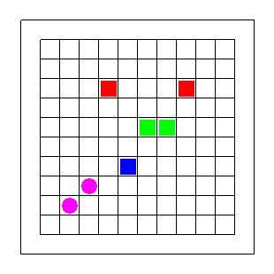

# Logic Games

C++ engine are being developed so as to facilitate a brick-game development, such as Snake, Sokoban or Tetris.

## Blocks

All the brick games consist of amount of building blocks that are situated on the field.
The smallest building block is supposed to be any figure, but the field grid can be different.

## Grid

A grid-system are supposed to be square two-dimensional grid, but it is also planned to create hexagon-grid system for the same games.

## Some screenshoots

